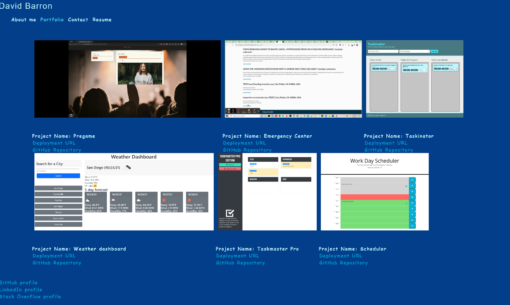

# React portfolio

## Description
Portfolio of my web development work.

## Table of Contents

* [Installation](#installation)
* [Usage](#usage)
* [License](#license)
* [Technologies](#technologies)
* [Screenshot](#screenshot)

## Installation
npm install

## Usage
npm start

## License
Licensed under the [MIT](https://choosealicense.com/licenses/mit/) license.

## Technologies
JavaScript, React

## Screenshot

